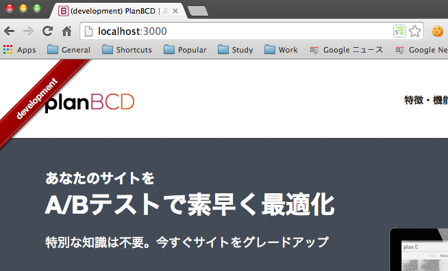
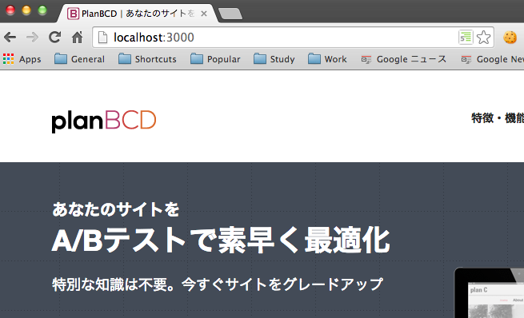

# rack-dev-mark

[![Gem Version][gem-image]][gem-link]
[![Dependency Status][deps-image]][deps-link]
[![Build Status][build-image]][build-link]
[![Coverage Status][cov-image]][cov-link]
[![Code Climate][gpa-image]][gpa-link]

Differentiate development environment from production.
You can choose [themes](THEME.md) to differentiate the page.

## Screenshot


### On Development Env



### On Production Env



## Installation

Add the rack-dev-mark gem to your Gemfile.

```ruby
gem "rack-dev-mark"
```

And run `bundle install`.

### For Rack App

```ruby
require 'rack/dev-mark'
use Rack::DevMark::Middleware
run MyApp
```

### For Rails App

In `config/environments/development.rb`

```ruby
Rails.application.configure do
  config.rack_dev_mark.enable = true
end
```

Or
In `config/application.rb`

```ruby
module MyApp
  class Application < Rails::Application
    config.rack_dev_mark.enable = !Rails.env.production?
  end
end
```

Or
Alternatively, use generator

```bash
bundle exec rails g rack:dev-mark:install
```

The middleware sets [title](lib/rack/dev-mark/theme/title.rb) and [github_fork_ribbon](lib/rack/dev-mark/theme/github_fork_ribbon.rb) themes as default.

#### Exclude Multiple Environments in Rails

Show the dev mark except env1, env2, env3.

In `config/application.rb`

```ruby
module MyApp
  class Application < Rails::Application
    config.rack_dev_mark.enable = !%w(env1 env2 env3).include?(Rails.env)
  end
end
```

#### Rails on Heroku

Since Heroku [uses production env for staging](https://devcenter.heroku.com/articles/multiple-environments). You can't use the settings above. However, the gem provide an easier way to set it up on Heroku. Just set the environment variable on the environment in which you want to show the mark.

```bash
heroku config:set RACK_DEV_MARK_ENV=staging
```

That's it!

#### Custom Rack Middleware Order

`rack-dev-mark` should be inserted before `ActionDispatch::ShowExceptions` becase we want to show the dev mark on the error pages as well. However, it does not work well if it's inserted by incorrect order with some other rack middlewares. So, it provides the setting of inserted place.

```ruby
module MyApp
  class Application < Rails::Application
    config.rack_dev_mark.insert_before = SomeOtherMiddleware
  end
end
```

`config.rack_dev_mark.insert_after` is also available to insert `rack-dev-mark` after a middleware.

[Here](COMPATIBILITY.md) is the compatibility list which many people often ask.

## Custom Theme

Although the default themes are `title` and `github_fork_ribbon`, you can create your own themes inheriting `Rack::DevMark::Theme::Base`.

```ruby
require 'rack/dev-mark/theme/base'

class NewTheme < Rack::DevMark::Theme::Base
  def insert_into(html)
    # Do something for your theme
    html
  end
end

class AnotherTheme < Rack::DevMark::Theme::Base
  def insert_into(html)
    # Do something for your theme
    html
  end
end
```

Then, insert them in your app.

### For Rack App

```ruby
use Rack::DevMark::Middleware, [NewTheme.new, AnotherTheme.new]
```

### For Rails App

In `config/application.rb`

```ruby
module MyApp
  class Application < Rails::Application
    config.rack_dev_mark.theme = [NewTheme.new, AnotherTheme.new]
  end
end
```

You can add any combination of themes. See more about [themes](THEME.md).

## Contributing

1. Fork it
2. Create your feature branch (`git checkout -b my-new-feature`)
3. Commit your changes (`git commit -am 'Add some feature'`)
4. Push to the branch (`git push origin my-new-feature`)
5. Create new [Pull Request](../../pull/new/master)

## Copyright

Copyright (c) 2014 Daisuke Taniwaki. See [LICENSE](LICENSE) for details.


[gem-image]:   https://badge.fury.io/rb/rack-dev-mark.svg
[gem-link]:    http://badge.fury.io/rb/rack-dev-mark
[build-image]: https://secure.travis-ci.org/dtaniwaki/rack-dev-mark.png
[build-link]:  http://travis-ci.org/dtaniwaki/rack-dev-mark
[deps-image]:  https://gemnasium.com/dtaniwaki/rack-dev-mark.svg
[deps-link]:   https://gemnasium.com/dtaniwaki/rack-dev-mark
[cov-image]:   https://coveralls.io/repos/dtaniwaki/rack-dev-mark/badge.png
[cov-link]:    https://coveralls.io/r/dtaniwaki/rack-dev-mark
[gpa-image]:   https://codeclimate.com/github/dtaniwaki/rack-dev-mark.png
[gpa-link]:    https://codeclimate.com/github/dtaniwaki/rack-dev-mark

