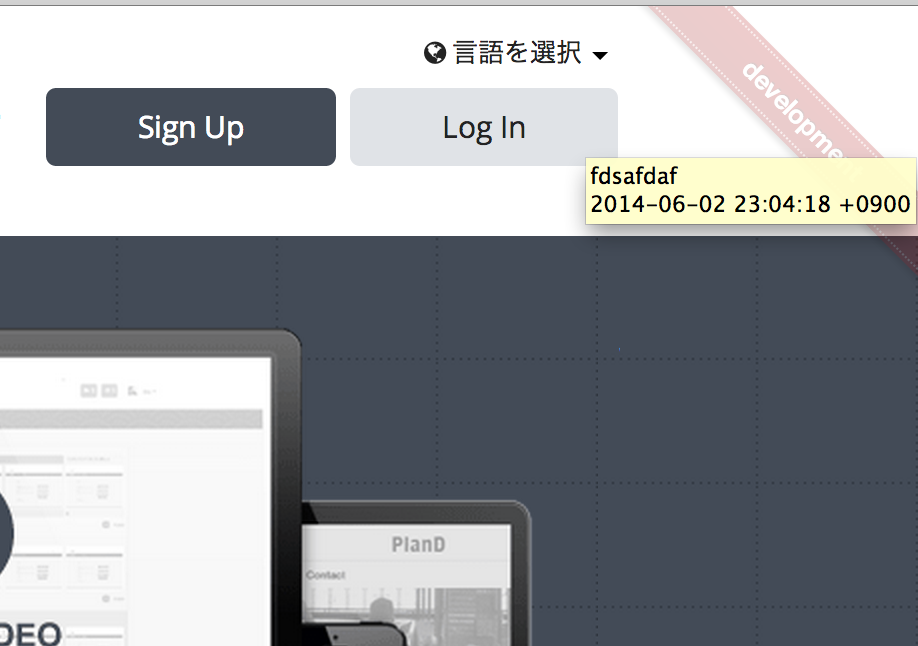

# Theme

You can set options when you add the themes into your app. Otherwise, just put the symbol of the theme filename.

### For Rack App

```ruby
use Rack::DevMark::Middleware, [:title, Rack::DevMark::Theme::GithubForkRibbon.new(position: 'right')]
```

### For Rails App

In config/application.rb

```ruby
module MyApp
  class Application < Rails::Application
    config.rack_dev_mark.theme = [:title, Rack::DevMark::Theme::GithubForkRibbon.new(position: 'right')]
  end
end
```

## tag

Insert the environment string into tags or attributes.

e.g.

`<div data-title="foo">foo</div>` can be `<div data-title="(env) foo">foo</div>`

### options

`type`: `prefix` (default) or `postfix`

`upcase`: `true` or `false` (default)

`name`: the name of tag to insert env

`attribute`: the name of attribute to insert env

## title

Just add the environment string into the page title.

e.g.

`My Homepage` on development env will be `(development) My Homepage`

options are the same as tag theme.

### options

`type`: `prefix` (default) or `postfix`

`upcase`: `true` or `false` (default)

## github_fork_ribbon

["Fork Me on GitHub" like ribbon](https://github.com/simonwhitaker/github-fork-ribbon-css) originally created by [simonwhitaker](https://github.com/simonwhitaker)

It shows a banner of the environment on the ribbon.


It also shows deployment revision and timestamp on the tooltip if available.



### options

`position`: left (default), right, left-bottom, right-bottom

`color`: red (default), orange, green, black

`fixed`: `true` or `false`(default)
